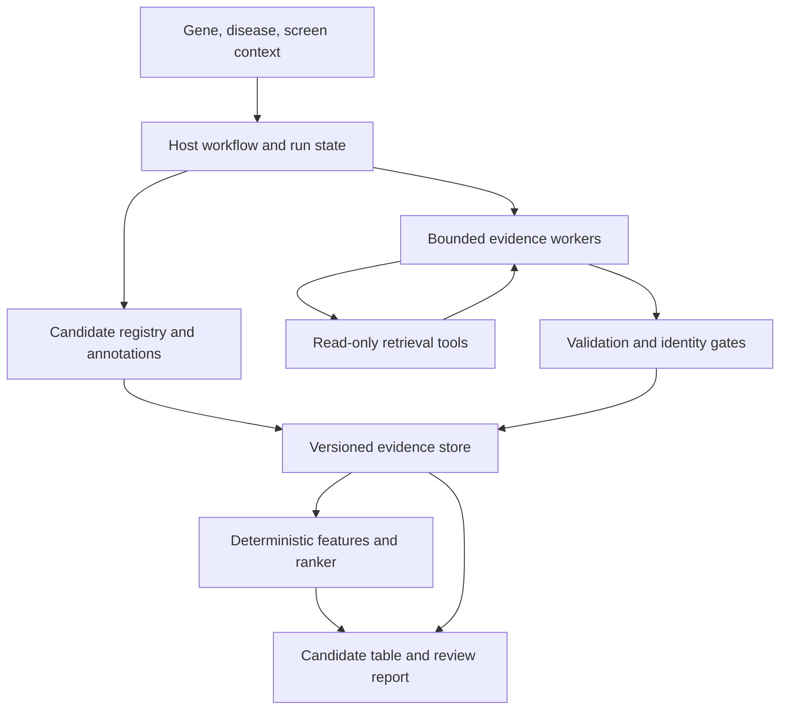

# Variant Evidence System — ARCHITECTURE

Version: 2.1.0-draft | Date: 2026-10-05

This file defines execution and enforcement of SPEC.md. Evidence object semantics live in EVIDENCE_SCHEMA.md; metric semantics live in EVAL.md. The architecture borrows the general pattern of fixed workflows containing bounded semantic workers from SRAgent; it does not claim to reproduce its published pipeline or benchmark.

## 1. Components and authority



The host owns state transitions, candidate closure, budgets, validation gates, persistence and ranks. The model observes a scoped view of a task, approved aliases, retrieved source content and budget information. It can issue declared tool calls or claim proposals. It cannot write raw SQL, change policies, invoke a shell, alter accepted records, or signal global run completion.

Worker roles may use the same provider and one process. LangGraph or another orchestrator is optional; an explicit Python state machine is sufficient for M0/M1. Harness means the entire enforcement layer, not only a library.

## 2. Execution stages and checkpoints

| Stage | Input → output | Gate / failure |
|---|---|---|
| INIT | Request/config → immutable run manifest | Invalid config: fail |
| RESOLVE | Gene/disease/reference policy → resolved scope | Ambiguity: needs_resolution, no invented choice |
| DISCOVER_INITIAL | Manual + ClinVar + gene literature → mentions | Record source failures and truncation |
| NORMALIZE | Mentions → canonical variants/aliases/exclusions | REF/assembly/transcript gates |
| ANNOTATE | Canonical variants → source annotations | Per-source result status; no required all-source success |
| PLAN_RESEARCH | Coverage + candidates → task queue | Deterministic allocation and recorded eligibility |
| RESEARCH | Scoped tasks → documents/draft claims/datasets/new mentions | Host budgets and tool permissions |
| EXPAND | New mentions → normalization and annotation | At most configured expansion rounds, M1 default one |
| CLOSE_CANDIDATES | Registry → frozen candidate snapshot | Late mentions deferred, no invisible truncation |
| VALIDATE | Proposals → decisions + immutable evidence versions | Reject/quarantine identity or citation failure |
| FREEZE_EVIDENCE | Evidence/annotations → snapshot digest | Include negative/rejected decisions in audit bundle |
| RANK | Frozen store + policy → features/order | Policy/capability validation; stable ties |
| EXPORT | Frozen objects → files/report | Referential integrity and output manifest |
| COMPLETE | Artifact hashes → terminal status | complete / partial / failed / needs_resolution |

EXPAND can return to NORMALIZE→ANNOTATE→PLAN_RESEARCH→RESEARCH once under the same total budget. A host counter, not a model request, authorizes it. After closure the registry digest is immutable for that run.

Each checkpoint is transactional: input digest, stage version, output digest, completion status, error code, started/finished timestamps. Reuse only when dependency digests match. A changed prompt or source snapshot invalidates affected downstream stages, not unrelated cached annotations.

## 3. Minimal source/tool abstraction

Conceptual signatures below are API contracts, not claims that packages or endpoints already exist:

```python
class SourceAdapter(Protocol):
    def capabilities(self) -> SourceCapabilities: ...
    async def query(self, request: ToolRequest) -> ToolResult: ...

class SemanticWorker(Protocol):
    async def step(self, task: WorkerTask, observations: list[ToolResult]) -> WorkerOutput: ...

def normalize_mention(mention, reference_bundle, transcript_bundle) -> IdentityDecision: ...
def validate_claim(claim, frozen_store, validation_policy) -> ValidationDecision: ...
def derive_features(variant_id, frozen_store, ranking_policy) -> FeatureRow: ...
def rank(feature_rows, ranking_policy) -> RankedTable: ...
```

ToolRequest requires schema version, tool name, approved parameters, task/run IDs and idempotency key. ToolResult requires status, structured payload, source snapshot IDs, retrieved timestamp, pagination/truncation, warnings, and error code. Empty success is not interchangeable with transient failure.

Capabilities describe assembly, supported alleles/modalities, query scope, pagination, snapshot identity, credentials, rate limits, licensing/cache restrictions and current verification date. Build adapters against verified current official docs. Do not copy assumed endpoint paths from prompts.

## 4. Source integration plan

| Source | M1 responsibility | Implementation constraint |
|---|---|---|
| HGNC/gene annotation | Stable gene ID and approved aliases | Freeze export/release; symbol may change |
| MONDO/approved ontology map | Disease matching/synonyms | Related concepts retained separately |
| Reference FASTA + transcript bundle | Canonical allele/isoform mapping | Assembly accession and checksums mandatory |
| ClinVar | Gene candidate enumeration, VCV/RCV/SCV assertions | Structured release/API; avoid HTML as primary classification source |
| gnomAD | Frequency and observed/callable status | Release/build/filter/AC/AN; missing record ≠ AF zero |
| VEP or equivalent | Consequence by transcript | Pin tool/database, options, reference |
| UniProt/InterPro | Domains/residue context | Versioned isoform-to-transcript mapping |
| AlphaMissense | Missense P key (local bulk tables) | Pin release; AVI already contains it |
| Splice predictor (SpliceAI-class) | Splice/synonymous P key | Pin model, distance and masking options |
| ClinGen dosage, gnomAD constraint, Gene2Phenotype | Gene mechanism assessment | Constraint ≠ mechanism; mapping rule declared |
| MaveDB | Evaluation labels only | Never a ranking input in benchmark runs |
| AlphaGenome Atlas | Supported AVI/molecular annotations | Store score definition, coverage, source dependencies; unsupported indel ≠ zero score |
| PubMed/Europe PMC | Search, records, available full text | Abstract/full-text/supplement availability and query translations logged |
| GEO | Accession metadata, samples, file/access status | GSE alone does not prove genotype or exact-variant samples |
| Optional design engine | Declared prime-editing designs | Host background, editor, search space, versions required |

Live genotype-private or controlled-access datasets can be identified as unavailable but not automatically accessed. No raw sequencing downloads required in MVP.

## 5. Variant normalization algorithm

1. Parse the original representation without losing transcript, assembly, orientation and source.
2. Resolve chromosome/reference sequence accession and release; coordinates use explicitly declared conventions.
3. Split multiallelic records into allele candidates while preserving parent IDs.
4. For nucleotide HGVS, use its accession/version and a reference-aware validator to produce a candidate genomic allele. Genomic representations are forward reference orientation even when the gene is on the minus strand.
5. For protein-only descriptions, identify all compatible transcript/allele mappings supported by resources; never reverse-translate to a single guessed nucleotide edit.
6. For GRCh37 input, perform variant-aware mapping to GRCh38 using pinned tools, re-check both assemblies' REF and ALT mapping. Reject unmapped/ambiguous transformations; simple coordinate liftover alone is insufficient.
7. Normalize a concrete literal GRCh38 allele to minimally represented, left-aligned VCF representation; preserve original HGVS, whose representation rules can differ.
8. Validate the normalized REF against the exact reference bundle; hash canonical identity material and add aliases with match evidence.
9. Map consequences to selected and alternative transcripts; never use transcript display differences to create duplicate alleles.

Symbolic ALT, structural variants, CNVs, breakends and unresolved haplotypes go to exclusions under M1. MNVs/complex alleles require a declared capability; do not split them into independent screen alleles without explicit intent. A single variant may be part of a cis allele context, which must be preserved.

## 6. Research scheduling and bounded loop

Perform shared gene–disease document discovery before per-allele gap resolution. Cache each publication and extract it once for all mentioned candidates when practical. Otherwise common gene-level evidence would be repeatedly retrieved and appear falsely independent.

Initial allocation SHOULD cover user-prioritized alleles, explicit controls, each candidate route and consequence group. Reserve a declared exploration fraction for low-evidence candidates. A top-only prefilter creates an evidence feedback loop: studied alleles are studied again while unresearched alleles appear unsupported.

Suggested engineering defaults (tunable, not scientific thresholds):

```yaml
budgets:
  run:
    max_deep_research_variants: 60
    max_discovery_expansion_rounds: 1
    max_unique_documents: 200
    max_tool_calls: 600
    max_llm_requests: 300
    max_wall_seconds: 3600
    max_input_tokens: 1000000
    max_output_tokens: 100000
    max_cost_units: null
  task:
    max_steps: 12
    max_queries: 6
    max_full_texts: 4
    max_supplements: 2
    max_geo_queries: 3
    max_schema_repairs: 1
    no_new_source_steps: 3
  scheduler:
    exploration_fraction: 0.20
    stable_selection_seed: 42
```

Actual cost caps require provider-specific pricing/unit definitions; `null` means disabled and must be reported. Token, request, query and wall-clock limits remain active. Deduplicate sources by digest/identifier for the no-new-source counter; claim counts cannot be manipulated to extend budgets.

```python
# Contract sketch: implementation must maintain counters/checkpoints.
while host.may_continue(task):
    response = await worker.step(task.scoped_view(), host.observations(task))
    host.record_model_output(response)
    if response.kind == "finish":
        host.store_proposals(response.claims, status="draft")
        host.finish_task(task, reason="worker_finished")
        break
    host.validate_tool_call(response.tool_call, task)
    host.reserve_budget(response.tool_call)
    result = await host.dispatch_read_only(response.tool_call)
    host.commit_observation(result)
else:
    host.finish_task(task, reason=host.stop_reason(task))
```

Stop at first reached host limit, exhausted permitted queries, explicit worker finish, or configured no-new-source threshold. Every stop reason maps remaining evidence slots to their real status. A worker saying “enough evidence” does not erase unsearched slots.

## 7. Tool permissions and hostile source text

Research tasks only receive stage-appropriate read-only tools. Fetch sources by returned IDs and approved hosts; validate redirects and schemes in wrappers. Supplement URLs follow the same rule. Documents are untrusted data, including any embedded instruction to ignore policies, run commands or disclose credentials.

Draft evidence submission is the only worker mutation and goes through host validation. Model-proposed tool names/arguments undergo schema and allowlist checks. Credentials are injected only by wrappers, never exposed to the model. Arbitrary shell, SQL and file-write tools are not in the worker catalog.

## 8. Validation layers

| Layer | Examples | What it cannot prove |
|---|---|---|
| Structural | JSON types, enums, required locator, FK checks | Scientific truth |
| Identity | Normalized allele, reference match, exact link justification | Study design quality |
| Citation location | Document/record exists, quoted span/field matches snapshot | Entailment merely from string existence |
| Semantic | Claim supported, exact versus gene, association versus function | Independent truth through a second LLM alone |
| Scientific/human | Context, limitations, confounds, mechanism assessments | Universal validity outside tested setting |

Automatic semantic acceptance requires successful mechanical gates and supported claim classification. Export as `accepted_auto`, not human-reviewed. A human rejection takes precedence over automatic acceptance for the same version. Quarantined/rejected claims do not contribute features. New corrected claims create a new version and link the old decision; no mutable provenance rewriting.

## 9. Storage and idempotency

M0/M1a: content-addressed JSONL bundle (DEC-13); M1b: SQLite plus immutable snapshot files; later PostgreSQL for concurrent deployment. Define repository interfaces and migrations, avoiding premature distributed services.

Core tables: runs, stages, variants, aliases, candidate_membership, source_snapshots, documents, claims, evidence_links, validation_decisions, annotations, datasets, sample_links, tasks, tool_calls, model_outputs, feature_rows, ranked_rows, reviews.

Key constraints:

- Canonical allele unique on reference accession + normalized POS/REF/ALT + identity version.
- Candidate membership unique on run + allele + route; roles can overlap.
- Snapshots immutable and addressed by content digest.
- Claims refer to a specific document/record snapshot and experiment/cohort where known.
- Validation decisions append-only; effective decision resolution is versioned.
- Ranking references exact frozen evidence digest and policy digest.
- Idempotent insert keys include source record/version and normalized claim/link material; a transient request retry does not duplicate evidence.

Cohort/experiment identity may be uncertain. Store `possible_overlap` and evidence for deduplication, rather than claiming all distinct DOIs are independent studies. M1 baseline uses tier maxima, not paper sums, reducing but not eliminating duplicate effects.

## 10. Cache and modes

Cache keys include source, canonical request, assembly/resource versions, endpoint/capability version and adapter version. Live cache entries have explicit TTL/refresh behavior. A frozen snapshot is never overwritten by refreshing a key; refreshed responses create new snapshot IDs.

| Mode | Network | LLM | Guarantee |
|---|---|---|---|
| replay | No | No | Reuse accepted extraction and annotations; identical stable content/rank |
| reextract | No | Yes | Frozen documents, new extraction; report measured variation |
| refresh | Yes | Yes when configured | Current responses and new output; record drift |
| compare | Operates on two saved runs | No by itself | Diff identity, source, extraction, policy and ordering changes |

Replay must fail clearly for missing artifacts; it cannot silently fetch or call a model. Compare attribution is causal only when exactly one factor changes; otherwise label a multi-factor diff.

## 11. Errors, retry and partial completion

Structured error taxonomy: invalid_input, unresolved_entity, identity_ambiguous, reference_mismatch, unsupported_variant, not_found, access_denied, rate_limited, transient_network, invalid_source_payload, schema_failure, semantic_rejection, budget_exhausted, snapshot_missing, integrity_failure.

Retry only transient errors and rate limits with bounded exponential backoff, jitter, and source-specific Retry-After handling. Suggested maximum: three transport retries, each timeout <= 30 seconds, backoff <= 30 seconds. Reserve counters before dispatch so retries cannot evade budgets; log physical attempts and logical queries separately. Deterministic fixture tests pin retry timing randomness.

Permanent source failure marks that slot failed and permits partial progress if optional. Entity/reference integrity failure prevents ranking of affected records. Export integrity failure fails the run. If required candidate routes fail, a partial run can still export a table, but must prominently say candidate discovery incomplete and cannot claim complete disease coverage.

## 12. Ranker and report implementation

Features are derived from accepted links, never free prose. For `nomination_v0.1`, implement strata, keys and tie handling exactly as SPEC.md §8; categorical keys are ordinal enums, P is compared only within one predictor. Ties are reported, not broken by hash. Persist each tier's contributing evidence IDs, unmet predicates and source coverage.

Explainers receive the frozen rank/features and cite accepted evidence. They may propose hypotheses in a separate field but cannot edit claims or rank. A deterministic report renderer should be the default; optional LLM explanations require claim checks and can be omitted on failure without losing exports.

## 13. Repository plan

Package is `tessera` (DEC-09). Paths are the target layout; Phase 0 modules not listed are archived:

| Path | Responsibility |
|---|---|
| variant-agent-spec-v2/ | These specifications and policy decisions |
| src/tessera/schemas/ | Strict typed contracts |
| src/tessera/identity/ | References, normalization, transcript mapping |
| src/tessera/tools/ | Source wrappers and capabilities |
| src/tessera/agents/ | Bounded scout/extractor/reviewer roles |
| src/tessera/workflows/ | Host state machine and budgets |
| src/tessera/db/ | Repository/migrations/snapshots/cache |
| src/tessera/evidence/ | Claim links, deduplication, validation |
| src/tessera/ranking/ | Features, profile validation, ordering |
| src/tessera/reporting/ | Tables, cards, manifests |
| src/tessera/cli.py | run, resume, replay, reextract, compare, evaluate |
| config/ and prompts/ | Versioned policies/source/query/model config |
| tests/fixtures/ | Synthetic and licensed source snapshots |
| benchmarks/ | Gold labels, split manifests, evaluation configs |

Provider adapters implement common request/response/error semantics. A specific OpenAI, Anthropic, or other API can be selected at build time; verification of current official endpoints is a builder responsibility. Do not embed provider session history as the authoritative run state.

## 14. Dependency and source references

Verify versions/access at implementation time. These are primary-source starting points, checked 2026-10-05; they are not frozen API contracts:

- SRAgent author repository: https://github.com/ArcInstitute/SRAgent
- ClinVar review status: https://www.ncbi.nlm.nih.gov/clinvar/docs/review_status/
- ClinVar data model: https://www.ncbi.nlm.nih.gov/clinvar/docs/data_model/
- AlphaGenome official overview/Atlas: https://deepmind.google/science/alphagenome/
- AlphaGenome SDK: https://github.com/google-deepmind/alphagenome
- AlphaGenome scoring documentation: https://google-deepmind-alphagenome.readthedocs-hosted.com/
- HGVS representation rules: https://hgvs-nomenclature.org/stable/recommendations/general/
- gnomAD coverage interpretation starting point: https://gnomad.broadinstitute.org/news/2021-10-coverage-added-to-variant-pages/

Endpoint examples, availability, AVI component definitions, licensing and model versions must be checked again in the capability audit. Source-specific prediction definitions must not be guessed from generic field names in this spec.
