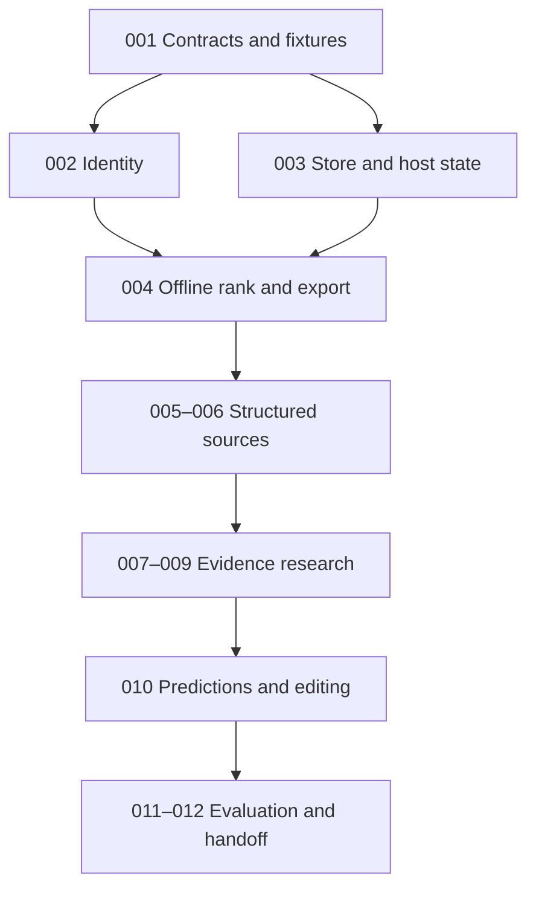

# Variant Evidence System — IMPLEMENTATION_PLAN

Version: 2.1.0-draft | Date: 2026-10-05

This plan turns the four specifications into bounded coding tasks inside the existing `tessera` package (DEC-09). tessera Phase 0 (a weighted composite scorer) is archived to `archive/phase0/`; nothing else is assumed to exist. Milestones: M0 offline slice (ISSUE-001–004), M1a structured real-gene run (005, 006, 006b), M1b research workers (007–010), evaluation (011), panel (013), handoff (012).

## 1. Builder entry contract

Read, in order: SPEC.md, EVIDENCE_SCHEMA.md, ARCHITECTURE.md, EVAL.md, REVIEW_GUIDE.md. Return a short pre-build discrepancy report. If no blocking contradiction exists, proceed with M0; scientific choices can stay provisional as already declared. Do not spend the first milestone scaffolding a web app or numerous agent classes.

Preserve R-01–R-20 and INV-01–INV-16. A proposed departure must name affected IDs, rationale, migration/evaluation impact and whether it changes scientific semantics. Routine dependency and code-structure choices are delegated to the builder.

## 2. Dependency and issue graph



The graph indicates prerequisites, not a request to run multiple coding agents. One agent can implement each issue sequentially. Source adapters may develop independently once the contracts exist, but scientific policies remain shared.

## 3. Issue specifications

### ISSUE-001 — Strict contracts and adversarial fixture design

Dependencies: none.

Implement schema models, generated JSON Schemas, canonical serialization/digest conventions and a small synthetic reference/source corpus. Include positive and negative cases from EVAL B0. Model only the required M0 objects before extending optional source payloads.

Acceptance:

- Strict types, unknown-field rejection, null/status consistency and FK relationships are enforced.
- Schema versions are exported; invalid exact-allele links cannot serialize as accepted.
- Fixtures have expected outcomes defined from their content, and are visibly synthetic.
- No real SETD1A allele or citation is fabricated.

Deliver model files, schema exports, fixture provenance and a requirements→tests mapping. Contract tests matter here because crossing identity/claim boundaries can change scientific conclusions.

### ISSUE-002 — Reference-aware identity and aliases

Dependencies: 001.

M0 scope (DEC-11): manual genomic (VCF-style) input, REF validation against a pinned FASTA, left-alignment/trimming normalization, alias registry, multiallelic split, ambiguity/exclusion ledgers. Transcript-aware HGVS mapping and assembly mapping move to M1a with real resources. Capability support must be explicit.

Acceptance:

- Equivalent representations merge; distinct alleles at one rsID stay distinct.
- REF mismatch and unresolved protein shorthand are quarantined, not ranked.
- Indels in repeats normalize to one left-aligned representation.
- Original representations and mapping alternatives remain available.

If a library cannot support a class, return unsupported and document the gap rather than hand-writing an unreliable fallback.

### ISSUE-003 — Content-addressed run bundle (SQLite and checkpoints deferred to M1b, DEC-13)

Dependencies: 001.

Implement a frozen run bundle: canonical JSON serialization, content digests, JSONL object files, manifest with input/config/code digests. Snapshots carry digests and license/access policy. Idempotent insert by content key.

Acceptance:

- Repeating an insertion or resuming a stage does not duplicate claims.
- Changing any input digest changes the bundle digest; identical inputs give identical digests.
- Completed run objects remain inspectable after new sources/decisions are added.

### ISSUE-004 — M0 offline vertical slice

Dependencies: 002, 003.

Implement gene mechanism assessment from fixture records, K/O/P feature derivation, `characterized` routing, stratified `nomination_v0.1` ordering with tie groups and degeneracy report, rejection-aware evidence references, and run exports. Use synthetic accepted evidence without LLM calls.

Acceptance:

- CSV has one row per normalized allele; transcript effects do not duplicate rows.
- Gene-level experiment cannot mark an allele characterized; related disease gives O=`related_condition`, never a case tier.
- Mechanism inversion (LoF ↔ GoF) reorders PTV vs missense concordance; unknown mechanism makes K degenerate and the report says so.
- No rank crosses strata; ties share tier rank.
- Duplicate source insertion leaves tiers/ranks unchanged.
- Replay has no network/model path and yields identical content hashes.
- Report states synthetic/provisional/unassessed status.

M0 completion is the first runnable deliverable. Do not describe it as biological validation.

### ISSUE-005 — Entity resolution and ClinVar candidate route

Dependencies: 004.

Implement pinned gene/ontology maps and ClinVar gene-level candidate enumeration with condition/assertion records, release/capability audit, pagination, source failures and aliases.

Acceptance:

- Gene input yields candidates within declared scope, not only disease-filtered records.
- VCV/RCV/SCV semantics and textual review status are retained.
- Counts of submissions/submitters/patients remain separate.
- Related disorders are marked related; conflicts and assertion types survive export.
- Integration tests use saved source responses; live smoke test is optional when credentials/network are available and reported separately.

### ISSUE-006b — Real-gene mechanism and prediction keys (M1a)

Dependencies: 006. ClinGen dosage, gnomAD constraint, Gene2Phenotype → GeneMechanismAssessment with declared rule; AlphaMissense from local tables; splice predictor import. Acceptance: first real SETD1A `nomination_v0.1` table with degeneracy report; mechanism basis inspectable.

### ISSUE-013 — Panel step

Dependencies: 006b. Per-stratum quotas, control counts, capacity, editing constraints from a declared panel policy (SCI-12).

### ISSUE-006 — Consequence, frequency and domain annotation

Dependencies: 005.

Implement VEP/equivalent, gnomAD and UniProt/InterPro adapters/import paths. Freeze tool/reference releases and record mapping status for transcript/isoform differences.

Acceptance:

- AF absence, uncallable region, measured zero and retrieval failure differ.
- All supported transcript effects are retained; MANE display policy is documented.
- Domain annotation specifies protein accession and residue mapping.
- Optional adapter failure yields a partial run with visible source coverage.

### ISSUE-007 — Publication discovery, snapshots and worker interface

Dependencies: 006.

Implement fixed PubMed/Europe PMC query templates and document deduplication first, then optional bounded adaptive query selection. Add a provider-neutral worker/tool-call interface and replayable model response storage.

Acceptance:

- Queries, source query translation, pagination and document access status are recorded.
- Abstract-only and full-text/supplement access are distinct.
- Host enforces all steps/calls/tokens/time limits and rejects forbidden actions.
- One expansion round normalizes newly discovered allele mentions; late mentions are deferred.
- The worker cannot write accepted evidence or final rank.

### ISSUE-008 — Evidence extraction, validation and deduplication

Dependencies: 007.

Implement draft claim extraction with source locators, exact/indirect links, mechanical checks, semantic review and optional human review import. Distinguish automatic acceptance from human acceptance.

Acceptance:

- Unsupported source, wrong-allele, gene→variant and introduction-mention fixtures are rejected/quarantined.
- A real citation without entailment is not enough.
- Duplicate publications/cohorts are linked with uncertainty rather than blindly summed.
- Human rejection overrides automatic acceptance for that revision.
- All rejected drafts survive in the audit output.
- No-effect and contradiction findings remain value-bearing evidence, not missingness.

### ISSUE-009 — GEO metadata and genotype relevance

Dependencies: 008.

Implement GEO discovery/detail retrieval and dataset/sample relevance links. Do not download raw sequencing data or infer genotype from title keywords.

Acceptance:

- Gene expression measurements, gene perturbations, disease context and confirmed exact-allele samples are distinct classes.
- Exact genotype claims have metadata/sample locators.
- Public raw/processed file access and controlled-access status are explicit.
- Dataset availability alone does not create functional outcomes.

### ISSUE-010 — Prediction and editing adapters

Dependencies: 006 and contracts from 001; end-to-end integration after 009.

Implement AlphaGenome Atlas lookup/import starting with supported SNVs, retaining release-specific score definition, raw values and prediction dependencies. Implement editing design import/schema validation and capability reporting; add a validated live design engine only if chosen.

Acceptance:

- Unsupported indels return unsupported, not absent/zero AVI.
- Prediction channel/tissue/gene assignment/calibration are inspectable.
- Component overlap is visible; baseline tiers do not consume raw AVI.
- `design_found` requires actual designs; estimated/measured efficiency is not fabricated.
- Missing host/editor parameters produce not_assessed where required.

### ISSUE-011 — Evaluation harness and gold import

Dependencies: 008, 009, 010.

Implement gold dataset import/validation, metrics with explicit denominators, split/cutoff manifests, mismatch outputs, replay/re-extraction comparisons and matched baseline runs.

Acceptance:

- No gold data yields not_evaluated, not a fake score.
- Candidate recall includes discovery failures; unjudged ranking labels remain unjudged.
- Draft and accepted unsupported-claim rates are both available.
- Publication/cohort leakage checks and effect-versus-editing distinctions are documented.
- Real source and owner-provided benchmark results are reported separately from synthetic tests.

### ISSUE-012 — Handoff and research MVP release

Dependencies: 011.

Deliver CLI, dependency lock, README, known limitations, requirement coverage, capability/source audit, offline demo and, when available, SETD1A run/evaluation bundle. Declare which SCI decisions remain open.

Acceptance:

- A reviewer can reproduce M0 without credentials.
- A reviewer can inspect each ranked feature's accepted source evidence.
- Real M1 source gaps and editing-unassessed status are visible.
- No unsupported claim of publication readiness, biological utility or optimized panel.

## 4. Proposed CLI acceptance examples

The following interfaces do not yet exist; the builder should provide equivalents:

```bash
tessera run --input benchmarks/synthetic/input.yaml --mode fixture --output runs/demo
tessera replay --bundle runs/demo --output runs/replay
tessera run --input benchmarks/setd1a/input.yaml --mode refresh --output runs/setd1a
tessera reextract --bundle runs/setd1a --output runs/reextract
tessera compare --left runs/setd1a --right runs/reextract
tessera evaluate --run runs/setd1a --gold benchmarks/setd1a/gold --split test
```

Fixture mode is an offline execution profile, not an additional reproducibility guarantee. CLI must accept explicit resource/config paths and report unavailable required capabilities. `--mode replay` must not be a live run disguised by cached queries.

## 5. Task completion report template

For each issue, report:

1. Concrete behavior implemented and affected requirement/invariant IDs.
2. Changed files and dependency/resource decisions.
3. Meaningful checks run and their outcomes.
4. Actual source capabilities versus missing/unsupported operations.
5. Scientific assumptions introduced or still provisional.
6. Remaining blockers and the next bounded task.

Do not list tests that merely mirror implementation and declare scientific correctness. Use adversarial identity/evidence scenarios and a real offline run. Stop expanding test scope after required checks pass unless a failure or unresolved concern justifies more work.

## 6. Copyable builder handoff prompt

> Read the complete version 2 specification package. First identify contradictions or requirements that cannot be implemented as written, citing file/section and R/INV IDs. Then implement ISSUE-001 through ISSUE-004 as one offline vertical slice, preserving all scientific semantics and provisional policy labels. Use a synthetic reference and synthetic source fixtures; do not invent real SETD1A variants, citations, scores or evaluation results. Keep the host authoritative over state, tools, budgets, evidence acceptance and ranking. Produce the required CSV/JSONL/manifest/report artifacts and exact replay checks. Report tests, source/dependency choices, open SCI decisions and concrete next tasks. Do not start M1 network adapters, a web UI, model training or autonomous multi-agent orchestration unless assigned afterward.
